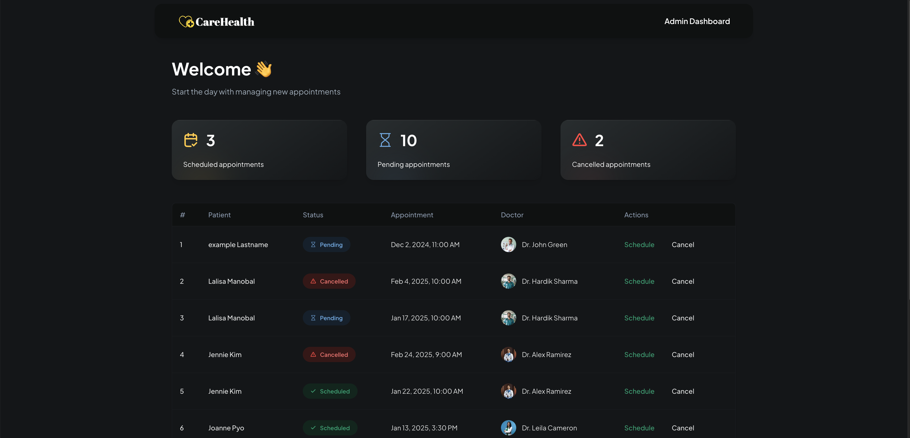

# CareHealth

CareHealth is an innovative web application designed for managing hospital appointments. It provides a user-friendly interface that allows patients to easily manage their bookings and communicate seamlessly with healthcare providers.

## Technologies Used

This project utilizes the following modern tech stack:

- **Next.js**: A React framework that provides server-side rendering and static site generation capabilities.
- **Twilio**: An API for SMS and phone communication.
- **TypeScript**: A superset of JavaScript that supports static typing.
- **TailwindCSS**: A utility-first CSS framework.
- **Appwrite**: A backend service management platform.
- **Sentry**: An application error monitoring and performance management tool.

## Getting Started

On the homepage, users can enter their **full name**, **email**, and **phone number**, and then click the **Get Started** button to begin using the service.

## Registration Page

After getting started, users are directed to the registration page, which includes the following sections:

1. **Personal Information**: Collects essential details about the user, such as their name, date of birth, and contact information.

   
2. **Medical Information**: Gathers relevant health history and current medical conditions to better assist healthcare providers.

   
3. **Identification and Verification**: Ensures the user's identity through various verification methods, including document uploads and confirmation processes.
4. **Consent and Privacy**: Provides information about data usage and privacy policies, requiring user consent to proceed with the registration.

   

## Appointment Page

On the Appointment Page, users can:

- **Select a Doctor**: Choose their preferred doctor or select one they wish to meet.
- **Choose Appointment Date and Time**: Pick the expected date and time for the appointment.

  
- **Specify Appointment Reason and Comments**: Clearly describe the reason for the appointment and provide any additional comments.

Once all the necessary information is filled out, users can click the **Submit Appointment** button.

## Success Page

After submitting the appointment request, users are redirected to the Success Page, where they will see a confirmation message indicating that their appointment request has been received. The details displayed include:

- The name of the doctor they requested an appointment with.
- The date and time of the requested appointment.
- An option to schedule a **New Appointment**.

## Admin Page

The Admin Page is where administrators can manage appointment requests from patients. When the admin clicks on the **Admin** option on the homepage, they are prompted with the **Admin Access Verification** screen. Here, the admin must enter the **Admin Passkey** to gain access.

## Admin Dashboard Page

Once verified, the admin is directed to the **Admin Dashboard**, which displays a list of all current appointment requests from patients. From this dashboard, the admin can:

- **Schedule Appointments**: Confirm and schedule appointments for patients.

  
- **Cancel Appointments**: Cancel existing appointments as needed.

  

After either scheduling or canceling an appointment, patients receive a confirmation message via SMS to their registered phone number.

## Conclusion

CareHealth is designed to streamline the appointment management process for both patients and healthcare providers. By leveraging modern technologies, the application offers a user-friendly interface for patients to easily schedule and manage their appointments while ensuring that healthcare professionals can efficiently oversee appointment requests through the Admin Dashboard.

With features such as personalized registration, appointment scheduling, and admin management, CareHealth aims to enhance the overall patient experience and improve communication within the healthcare system. We believe this application will contribute to better patient care and more organized appointment management.

Thank you for exploring the CareHealth project.
